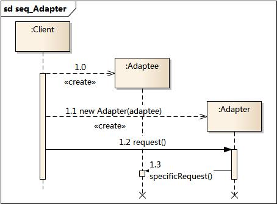

### 适配器模式

1. 动机
  - 解决接口不兼容的情况
2. 定义
  - 把一个接口转换成另一个接口
3. 结构
  - 目标抽象类
  - 适配器类
  - 适配者类
  - 客户类
4. 时序图
  
5. 代码分析
```php
interface Target {
  function request();
}
class Adaptee {
  function request() {};
}

class Adapter {
  function request() {};
}
```
6. 总结
  - 扩展原有类，采用第三方适配器改变原有类的行为
  - 对客户端是透明的，客户端可根据不同场景调用不同的适配器